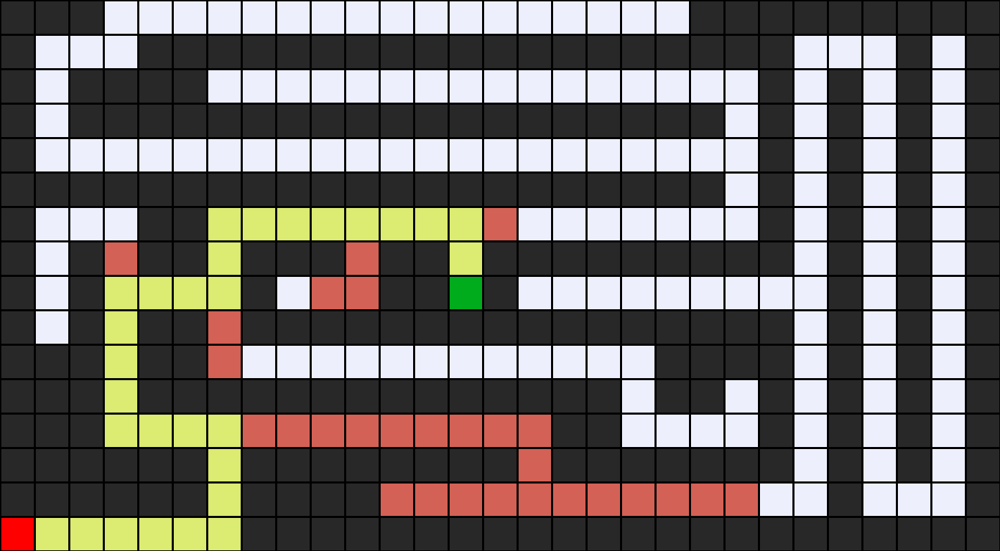
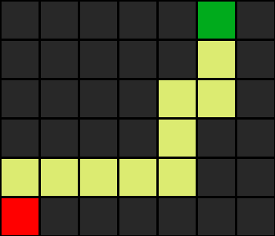
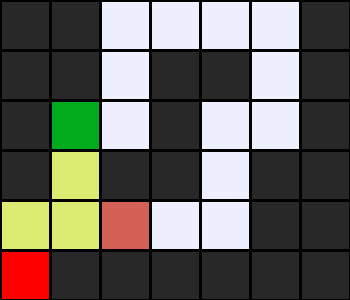
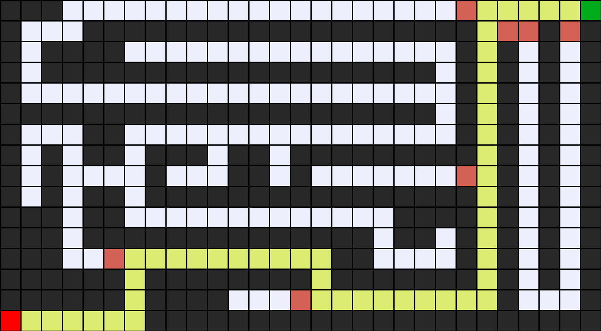

# Greedy best-first search with maze

## Description
    Using Greedy best-first search to find the shortest way from A to B!

## File and directory
    - __pycache__ directory
    - image directory: including all image used for this README
    - maze.py
    - util.py
    - requirements.txt
    - README.md
    - maze1.txt
    - maze2.txt
    - maze3.txt

### util.py
    In util.py, I created 2 class using Object-Oriented Programming:
    - Node: 
        + state: where the node is.
        + parent: the previous node.
        + action: the action of previous node to the state.
        + heuristic: the heuristic from the state to the goal.
    - QueueFrontier:
        + Create an empty frontier to save the node.
        + Enqueue the node by adding function takes two arguments: self and node.
        + Check whether the node is in the frontier or not by using the contains_state function to return all nodes in the frontier.
        + Create empty function to check the frontier is empty or not.
        + Dequeue the node depending on FIFO by checking whether the frontier is empty or not. If the frontier is not empty, delete the shorted node depending on heuristic.

### maze.py
    In mazed.py, I created Maze class. Maze class includes:
    - __init__ function initializes the start, the goal, the wall, and the road.
    - Print function prints the way from the start to the goal by using "*".
    - Neighbors function returns all nodes that the state can reach.
    - Heuristic function returns the step from the state to the goal.
    - Solve function is the function using Greedy best-first search to seek the right way with. Let's see how it work:
        + First, I create a frontier by using the QueueFrontier class from util.py.
        + Second, I create an explored set and number explored to save the node I seek and calculate all the node I add.
        + Third, I enqueue the start to the frontier.
        + Last, I loop through the frontier to seek the goal. If the node is the goal, the function will return the solution. On the opposite, the loop will continue and the node explored will be saved in the explored set. Do it until explore the goal. If the frontier reaches the end, it will raise an exception with the message: "No solution".
    - Output_image function will return an image with the maze solved!

### Result
    Let's see what happen:

    In the above image, you can see a lot of square with 6 colors: red, green, orange, white, gray, yellow
    - The red square is the start.
    - The green square is the goal.
    - The orange squares is these node that explored but the heuristic is too far.
    - The yellow squares is these node that describes the way from the start to the goal.
    - The white squares is the way that the node can move.
    - The gray squares is the walls.

    This is some mazes that solved by Greedy best-first search:

